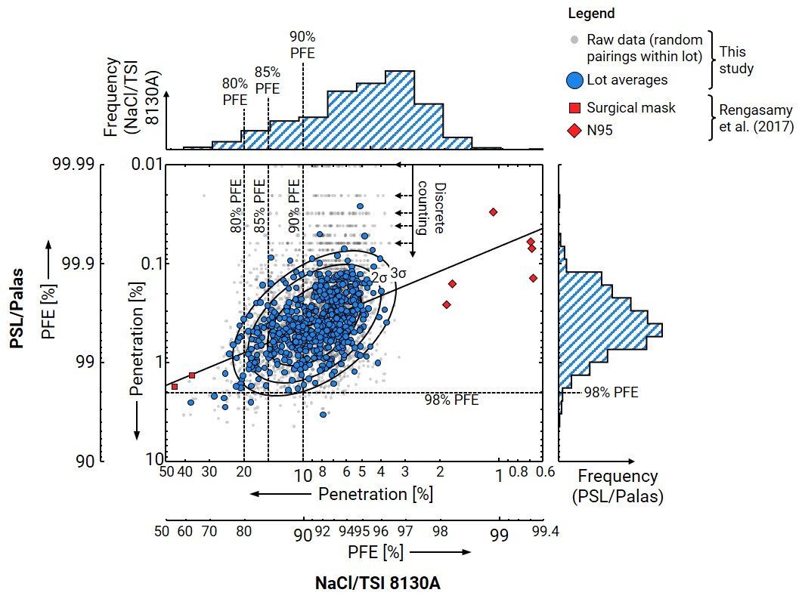

# NRC Mask Data

This is a parent repository for open data from the National Research Council Canada (NRC) related to the measurement of particle filtration efficiency (PFE) of filtration media, largely in connection with face mask products. A README is available in each sub-repository with specific details on the data and associated code. GPL-3.0 license licence applies to each sub-repository, unless otherwise stated. It currently contains the following sub-repositories: 

## SD22

This dataset contains data for an article discussing the difference between PFE testing using a polydisperse ***NaCl*** or monodisperse ***PSL*** challenge aerosol. This is an important dataset in showing the equivalent levels of PFE between the two test methods. 

## JOEH22

This dataset contains data associated with [Sipkens et al. (J. Occup. Evinron. Hyg., 2022)][joeh22], an article discussing various representations of PFE with a focus on the difference between number-based PFE (NPFE) and mass-based PFE (MPFE). This folder also contains Matlab code supporting the associated publication, generating the figures from that work. 

[joeh22]: https://doi.org/10.1080/15459624.2022.2114596
